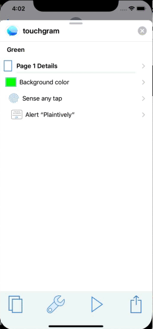
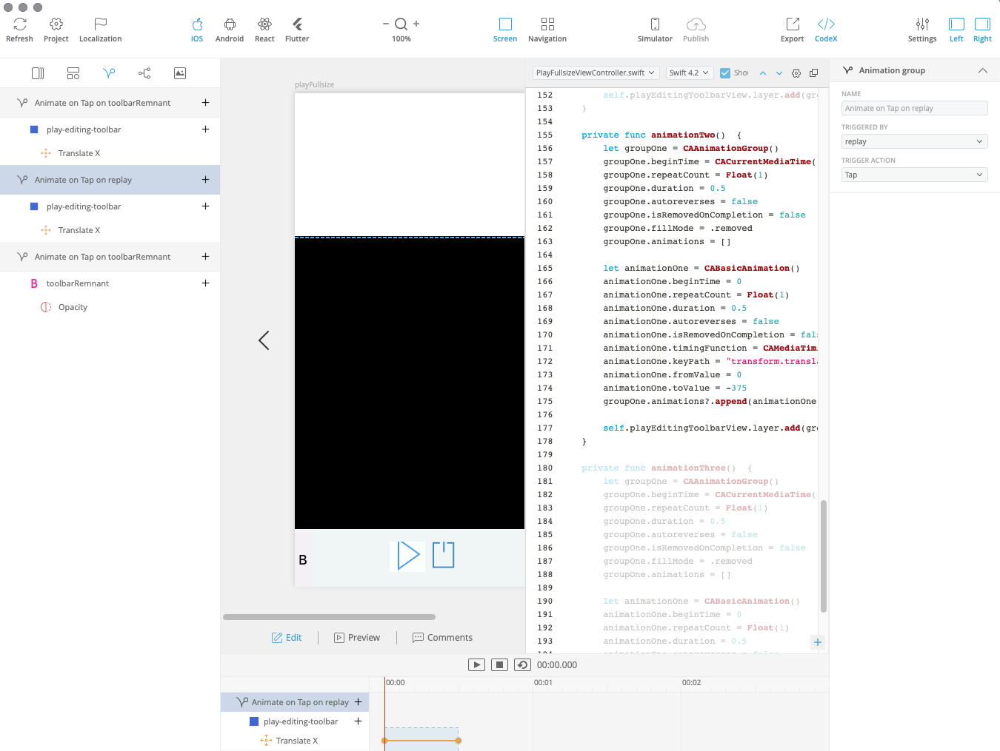

<!-- usual source https://unpkg.com/@lottiefiles/lottie-player@latest/dist/lottie-player.js -->
<!-- local source doesn't work opening directly "./assets/lottie-player.js" only if playing from local server -->

#

# Anyone can Animate {bg=#eee}

**(Even if they can't draw)**

Andy Dent's

strongly-held opinions

weakly-held pencils

# Animation as Life?

**(but not as we know it)**

See lots of links on my github site (also be on the last slide)

[github.com/AndyDentFree/DDD19][gh]

- Val Head's book _Interface Animation_, videos etc
- Disney's book [The Illusion of Life][ill]
- [As video][12p] and [gifs][12g] 8 of which follow
- [Really good article][Dis12] illustrating them with longer clips from Disney and Pixar movies, and explanations

<aside class="notes">
The gifs come from the video mentioned which show film fake scratches so you see odd flashes of hair and other tiny white marks
</aside>

# Principle 1 - Squash and Stretch

# Principle 2 - Anticipation

# Principle 5 - Follow Through & Overlapping

# Principle 6 - Slow In and Slow Out

# Principle 7 - Arcs

# Principle 8 - Secondary Action

# Principle 9 - Timing

# Principle 10 - Exaggeration

# Why Animate? - Designers

**Amuse**

Distract

Inform

<lottie-player 
    src="./assets/8103-jump.json"  background="transparent"  speed="1"  style="width: 300px; height: 300px;"  loop autoplay >
</lottie-player>

<aside class="notes">
Start at about 3:30
</aside>

# Why Animate? - Designers

Amuse

**Distract**

Inform

<lottie-player 
    src="./assets/961-checked-loading.json"  background="transparent"  speed="1"  style="width: 300px; height: 300px;"  loop autoplay >
</lottie-player>

<aside class="notes">
Start at about 3:30
</aside>

# Why Animate? - Designers

Amuse

Distract

**Inform**

<lottie-player 
    src="./assets/926-menu-volver.json"  background="transparent"  speed="1"  style="width: 300px; height: 300px;"  loop autoplay >
</lottie-player>

<aside class="notes">
Start at about 3:30
</aside>

# Why Animate? - Developer's View

**D** istract

**I** nform

**E** ntertain

# Animation as a new Developer Hell

Animation's aren't the only thing that go in circles.

The designer-developer loop finds new things to design that have to be manually translated to code.

and then the loop closes

# Coming to [save us][flash] (last time)
 

# New Breed of Tools

Start with Sketch or other vector prototype

Add animation

Generate working code
<aside class="notes">
Start at about 6:00
</aside>
# Web world

SVG-based vectors

Pure CSS 

GSAP Greensock JS-driven canvas

and...
<aside class="notes">
Not focused on this
</aside>

# Lottie

Simple animated vectors from Adobe After Effects via _bodymovin_ plugin to JSON, effectively a [standard][lottieAE]

Fast native & web players by [AirBnb][airbnbLottie]

Other editors such as [Haiku] and [Keyshape]

As seen on the Why Animate? - Designers slide, content from [lottiefiles.com][lottieSamples]

# Mostly Mobile Tools

Supernova Studio

Haiku

Flow 

# Simple Animation Example

<aside class="notes">
Start at about 10:40
</aside>

# Supernova Editor

# Supernova Generated - Swift

# Supernova Generated - Kotlin

# Supernova Generated - React Native

<aside class="notes">
Flutter not yet generating animation
</aside>

# Supernova Intro
<aside class="notes">
Movie Start at about 11:40
</aside>

# Supernova Play Editing Controls
<aside class="notes">
Movie Start at about 15:40
</aside>

# Further Details

[github.com/AndyDentFree/DDD19][gh]

Contains this presentation and links to all tools mentioned, full samples and media to build anything shown in the movies.

Twitter: @andydentperth

[gh]: https://github.com/AndyDentFree/DDD19
[12p]: https://vimeo.com/93206523
[ill]: https://www.amazon.com/Illusion-Life-Disney-Animation/dp/0786860707/ref=sr_1_1?ie=UTF8&qid=1452379828&sr=8-1
[12g]: https://the12principles.tumblr.com/
[flash]: https://www.youtube.com/watch?v=LfmrHTdXgK4
[Dis12]: https://ohmy.disney.com/movies/2016/07/20/twelve-principles-animation-disney/
[lottieSamples]: https://lottiefiles.com/b.bfer
[airbnbLottie]: http://airbnb.io/lottie/#/
[Keyshape]: https://www.keyshapeapp.com/
[Haiku]: https://www.haiku.ai/
[lottieAE]: http://airbnb.io/lottie/#/supported-features
